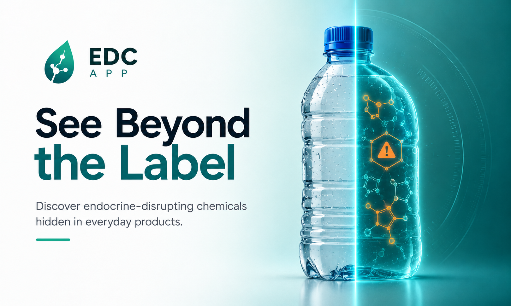

# EDC Scan — Flutter Client



A mobile app that helps people spot **endocrine-disrupting chemicals (EDCs)** in everyday
products by scanning barcodes and ingredient labels. This repo is the **Flutter client** — a
deliberately *thin* client: it captures input and renders results, while OCR, chemical
recognition, the EDC knowledge base, and risk scoring all live in the backend
([Safe Basket](https://github.com/Paras-ydv/Safe_basket)).

> **Disclaimer:** Not medical advice. Risk assessments come from the backend and are screening
> estimates, not a substitute for laboratory confirmation.

---

## Highlights

- **Thin-client architecture** — the app never classifies a chemical or computes a risk score;
  it displays decisions the backend already made (see `docs/flutter_app_architecture.md`).
- **Feature-first** structure with a strict Widget → Notifier → Repository layering.
- **Strict dark, "cyber-lab" theme** — palette: primary accent `#00E5FF`, surface `#121921`,
  background `#090C11`. Typography: Space Grotesk (headings) / Plus Jakarta Sans (body) /
  JetBrains Mono (data readouts). Risk color tokens exposed as a `ThemeExtension`.
- **Develop against fakes or the real backend** with a single build flag — no code changes.
- **Sealed UI state** — every capture flow uses a sealed `ScanCaptureState` so the screen
  exhaustively handles idle / submitting / processing / success / failure.

---

## Screens

| Screen | Route | Description |
|---|---|---|
| Home | `/` | Hero banner, "Start Scanning" CTA, notification bell, recent-scan teaser |
| Scan Options | `/scan` | Four capture tiles: Barcode, Label, Water, Manual + recent scans list |
| Barcode Scanning | `/scan/barcode` | Live camera, on-device symbology decode, torch toggle |
| Label / OCR | `/scan/label` | Camera capture → async OCR job → polling "processing" state |
| Manual Entry | `/scan/manual` | Free-text product / chemical query |
| Water Check | `/scan/water` | Water source + location input → environmental `ScanResult` |
| Scan Result | `/scan/result/:scanId` | Overall risk banner, detected chemicals list, PDF export, disclaimer |
| Chemical Details | `/chemical/:id` | Name, risk badge, class, health effects, exposure routes, regulatory status |
| Safer Alternatives | `/chemical/:id/alternatives` | Lower-risk alternatives for a chemical |
| History & Trends | `/history` | Tabbed: scan history list + exposure-over-time charts |
| Water | `/water` | Water Check entry point (bottom-nav tab) |
| Learn | `/learn` | Static educational content about EDCs |
| Profile | `/profile` | Notification preferences (high-risk alerts, weekly digest, recalls) |
| Notifications | `/notifications` | In-app notification inbox |

---

## Tech stack

| Concern | Choice |
|---|---|
| State management | Riverpod (`@riverpod` codegen, `AsyncNotifier` / sealed-state notifiers) |
| Navigation | GoRouter (named routes, `StatefulShellRoute` bottom-nav shell) |
| Models | Freezed + JsonSerializable (snake_case wire, matching the backend) |
| Networking | Dio (auth + envelope-unwrap interceptors, typed `ApiException`s) |
| Camera / barcode | `mobile_scanner` |
| Image capture | `image_picker` |
| Charts | `fl_chart` |
| PDF export | `pdf` + `printing` |
| Local storage | `shared_preferences` |
| Notifications | `flutter_local_notifications` (+ in-app inbox) |
| Fonts | `google_fonts` (Space Grotesk, Plus Jakarta Sans, JetBrains Mono) |

**Version:** `1.0.0+1` · **Dart SDK:** `^3.12.2`

---

## Project structure

```
lib/
├── core/
│   ├── enums/
│   │   └── risk_level.dart        # RiskLevel enum (low/moderate/high/veryHigh)
│   ├── models/
│   │   ├── scan_result.dart       # ScanResult — shared across scan, home, history
│   │   └── detected_chemical.dart # DetectedChemical — embedded in ScanResult
│   ├── network/
│   │   ├── api_config.dart        # baseUrl + USE_FAKES flag (dart-define)
│   │   ├── api_exception.dart     # Sealed ApiException hierarchy
│   │   ├── auth_interceptor.dart  # Injects X-User-Id header
│   │   ├── dio_provider.dart      # Riverpod provider for the Dio instance
│   │   └── envelope_interceptor.dart  # Unwraps { data, disclaimer, error }
│   ├── notifications/
│   │   └── local_notifications_service.dart
│   ├── report/
│   │   └── scan_report_builder.dart   # Client-rendered PDF export
│   ├── router/
│   │   ├── app_router.dart        # GoRouter + StatefulShellRoute shell
│   │   └── route_names.dart       # Named route constants
│   ├── storage/
│   │   └── shared_preferences_provider.dart
│   ├── theme/
│   │   ├── app_theme.dart         # Dark ThemeData + three-font hierarchy
│   │   └── risk_colors.dart       # RiskColors ThemeExtension + context.riskColors
│   └── widgets/
│       └── placeholder_screen.dart
└── features/
    ├── scan/
    │   ├── data/
    │   │   ├── scan_repository.dart       # Abstract interface
    │   │   ├── api_scan_repository.dart   # Dio-backed implementation
    │   │   └── fake_scan_repository.dart  # In-memory fake (mimics async OCR polling)
    │   ├── application/
    │   │   ├── scan_capture_controller.dart  # Sealed state: idle/submitting/processing/success/failure
    │   │   └── scan_result_provider.dart
    │   ├── domain/
    │   │   ├── scan_mode.dart   # ScanMode.barcode / .label
    │   │   └── scan_job.dart    # ScanJobStatus + ScanJobState (pending/done/failed)
    │   └── presentation/
    │       ├── scan_options_screen.dart
    │       ├── scanning_screen.dart
    │       ├── scan_result_screen.dart
    │       ├── manual_entry_screen.dart
    │       └── water_check_screen.dart
    ├── chemical/
    │   ├── domain/
    │   │   ├── chemical_detail.dart  # id, name, risk, class, healthEffects, exposureRoutes
    │   │   ├── alternative.dart
    │   │   └── exposure_route.dart   # dermal / ingestion / inhalation
    │   └── presentation/
    │       ├── chemical_detail_screen.dart
    │       └── chemical_alternatives_screen.dart
    ├── history/
    │   ├── domain/
    │   │   └── trends.dart   # TrendPoint + Trends (weeklyScanCounts, riskDistribution)
    │   └── presentation/
    │       └── history_screen.dart
    ├── home/
    ├── learn/
    ├── notifications/
    │   └── domain/
    │       └── app_notification.dart  # id, title, body, receivedAt, risk, read
    └── profile/
        └── domain/
            └── profile_preferences.dart  # highRiskAlerts, weeklyDigest, productRecalls
```

Each feature exports a barrel `<feature>.dart`. Cross-feature access goes through barrels only.

---

## Getting started

```bash
flutter pub get
dart run build_runner build --delete-conflicting-outputs   # generate Freezed / Riverpod code
flutter run
```

Common commands:

```bash
flutter analyze          # lint
flutter test             # unit + widget tests
dart run build_runner watch --delete-conflicting-outputs   # regen on change
```

> Do **not** edit `*.g.dart` or `*.freezed.dart` files directly — always regenerate with
> `build_runner`.

---

## Backend & the `USE_FAKES` flag

By default the app binds **real Dio repositories** pointed at `ApiConfig.baseUrl`. Configure at
build time:

```bash
# Run against a live backend
flutter run --dart-define=API_BASE_URL=https://your-host/v1

# Run fully offline against in-memory fake repositories
flutter run --dart-define=USE_FAKES=true
```

The fake repositories are production-quality stand-ins:
- `FakeScanRepository` tracks poll counts per job id so async OCR jobs report `pending` twice
  before completing — matching the real polling flow.
- All fakes return realistic canned data (e.g. "Sunrise Body Lotion" with BPA, Butylparaben,
  Phenoxyethanol) so screen work is never blocked by backend availability.

The client speaks the shared **`edc_contracts`** wire format (in the Safe Basket repo): the
`{ data, disclaimer, error }` envelope is unwrapped by `EnvelopeInterceptor`, JSON is
snake_case, and the backend sends a normalized `risk` enum (`low`/`moderate`/`high`/`very_high`).
Auth currently uses an `X-User-Id` header (a stable per-install device id from
`shared_preferences`) until Google Sign-In lands. See `docs/flutter_app_architecture.md` §3
for the full contract, and `docs/backend_integration_brief.md` for the backend-side backlog.

---

## Architecture

### Layer boundaries

```
Widget (UI only)
   │  reads state / calls notifier methods — no logic, no Dio, no I/O
   ▼
Notifier (AsyncNotifier / sealed-state notifier)   ← orchestration & UI state only
   │  calls repository — never touches Dio or JSON directly
   ▼
Repository                 ← the ONLY place that talks to the network
   │  Dio + interceptors, maps JSON ⇄ Freezed models, throws typed ApiException
   ▼
Backend API (not ours)
```

### Ownership boundary

```
        ┌────────────────────── OURS (Flutter app) ──────────────────────┐
 user → │ capture → validate format → package request → HTTP → render     │
        └───────────────┬───────────────────────────────▲────────────────┘
                        │ request (barcode / image / manual / location)   │ response (JSON)
        ┌───────────────▼───────────────────────────────┴────────────────┐
        │  BACKEND (not ours): OCR, NLP, knowledge base, risk engine,     │
        │  external APIs, lab validation, ML feedback loop                │
        └─────────────────────────────────────────────────────────────────┘
```

The app **never** classifies a chemical, computes a risk score, or authors clinical content.
Every risk value, health effect, and disclaimer arrives from the backend and is rendered
verbatim.

### Networking

- **`EnvelopeInterceptor`** — strips the `{ data, disclaimer, error }` wrapper so repositories
  parse `response.data` directly as the model.
- **`AuthInterceptor`** — injects `X-User-Id` on every request. Slot is wired for Google
  Sign-In JWT when that lands.
- **`ApiException` hierarchy** — sealed: `NetworkException`, `TimeoutException`,
  `UnauthorizedException`, `ServerException`, `UnknownApiException`. Repositories throw these;
  widgets never see raw `DioException`.

### Scan capture state machine

`ScanCaptureController` uses a sealed `ScanCaptureState`:

| State | Meaning |
|---|---|
| `ScanIdle` | Camera live, waiting for input |
| `ScanSubmitting` | Upload in progress (short, synchronous phase) |
| `ScanProcessing` | Async OCR job being polled (longer wait — design for it) |
| `ScanSuccess(scanId)` | Navigate to `/scan/result/:scanId` |
| `ScanFailure(message)` | Show error, offer retry |

OCR polling: max 20 attempts, 800 ms interval. On timeout → `ScanFailure`. Cancel is
supported at any point.

### Risk level tokens

| Enum | Wire value | Label | Color |
|---|---|---|---|
| `RiskLevel.low` | `low` | Low – minimal concern | teal `#2EC4B6` |
| `RiskLevel.moderate` | `moderate` | Moderate – some concern | amber `#FF9F1C` |
| `RiskLevel.high` | `high` | High – significant concern | coral `#FF4D6D` |
| `RiskLevel.veryHigh` | `very_high` | Very High – severe concern | scarlet `#FF1744` |

Risk colors are resolved via `context.riskColors` (a `ThemeExtension`) — never hardcoded.
The backend normalizes its free-form `severity` field to this 4-value enum before sending.

---

## Navigation

GoRouter with a `StatefulShellRoute` bottom-nav shell (Home · History · Water · Learn ·
Profile). Full-screen flows (scan, chemical detail, notifications) live outside the shell so
they cover the bottom nav.

| Route | Name constant | Screen |
|---|---|---|
| `/` | `home` | Home dashboard |
| `/scan` | `scan` | Scan Options hub |
| `/scan/barcode` | `scanBarcode` | Live barcode scanning |
| `/scan/label` | `scanLabel` | Label / OCR capture |
| `/scan/manual` | `scanManual` | Manual entry |
| `/scan/water` | `scanWater` | Water source capture |
| `/scan/result/:scanId` | `scanResult` | Scan result |
| `/chemical/:id` | `chemicalDetail` | Chemical details |
| `/chemical/:id/alternatives` | `chemicalAlternatives` | Safer alternatives |
| `/history` | `history` | History & Trends |
| `/water` | `water` | Water Check (bottom-nav tab) |
| `/learn` | `learn` | Learn |
| `/profile` | `profile` | Profile |
| `/notifications` | `notifications` | Notification inbox |

Navigate with `context.goNamed(RouteNames.x)` — never use raw path strings.

---

## API contract (summary)

All responses use the `{ data, disclaimer, error }` envelope, unwrapped by `EnvelopeInterceptor`.
JSON is snake_case throughout. Auth via `X-User-Id` header.

| Endpoint | Status | Purpose |
|---|---|---|
| `POST /scan/barcode` | ✅ Done | Barcode lookup → `ScanResult` |
| `POST /scan/manual` | ✅ Done | Manual entry → `ScanResult` |
| `POST /scan/image` | 🔨 To build | Submit label image → `{ job_id }` |
| `GET /scan/image/{jobId}` | 🔨 To build | Poll OCR job → `ScanResult` when done |
| `GET /scan/{scanId}` | 🔨 To build | Fetch a stored scan |
| `GET /history` | 🔨 To build | User scan history (newest first) |
| `POST /scan/water` | 🔨 To build | Water source check → `ScanResult` |
| `GET /chemicals/{id}` | 🔨 To build | Chemical detail |
| `GET /chemicals/{id}/alternatives` | 🔨 To build | Safer alternatives |
| `GET /notifications` | 🔨 To build | In-app notifications |

**Report export is client-rendered** — the app builds the PDF from the `ScanResult` /
`ChemicalDetail` data it already holds on-device (`pdf` + `printing`). No export endpoint.

### Core model shapes (snake_case JSON)

```jsonc
// ScanResult
{ "scan_id", "product_name", "scanned_at" (ISO-8601 UTC),
  "overall_risk": "low|moderate|high|very_high",
  "product_meta": string|null,
  "detected_chemicals": [ DetectedChemical ],
  "disclaimer": string|null }

// DetectedChemical
{ "id", "name", "risk" }

// ChemicalDetail
{ "id", "name", "risk", "chemical_class", "regulatory_status",
  "health_effects": [string],
  "exposure_routes": ["dermal"|"ingestion"|"inhalation"] }

// AppNotification
{ "id", "title", "body", "received_at", "risk": <risk>|null, "read": bool }
```

---

## Testing

```bash
flutter test
```

`test/contract_alignment_test.dart` proves the client models parse the backend's snake_case
wire format correctly, including:
- `ScanResult` with `very_high` overall risk and nested `DetectedChemical`
- `ChemicalDetail` with `exposure_routes` and `health_effects`
- `AppNotification` with `received_at` UTC parsing
- Round-trip JSON serialization confirming `overall_risk` wire value is `very_high` not `veryHigh`

---

## Conventions

- `ref.invalidate()`, not `ref.refresh()`.
- No business logic in widgets — logic lives in notifiers / repositories.
- No API calls in notifiers — always go through the repository layer.
- Repositories are the only network boundary; they return domain models, never raw JSON.
- One public widget per file; private widgets are underscore-prefixed.
- Barrel exports via `feature.dart`; cross-feature access goes through barrels only.
- Do not modify `*.g.dart` or `*.freezed.dart` files directly — regenerate with `build_runner`.

See `CLAUDE.md` for the full rule set.

---

## Status & known gaps

- **Google Sign-In** — deferred (needs an OAuth client id); the `AuthInterceptor` has the slot
  wired for a JWT/Bearer token when it lands.
- **Live end-to-end** — history, chemical detail, alternatives, water, notifications, and async
  image OCR all depend on backend routes still being built; they work today against fakes.
- **Android release build** — needs a valid `JAVA_HOME` on the build machine.
- **Backend blockers** — `dart analyze` reports pre-existing errors in Safe_basket
  (`routes/scan/photo.dart`, `routes/admin/middleware.dart`) from package-version drift;
  owned by the backend team.
- **Alternatives & notifications data** — `EdcEntry` has no "safer alternative" or
  notifications table yet; approach to be confirmed with the backend team.
- **Offline support** — expectations (which lookups must work without connectivity) not yet
  confirmed with the backend team.
